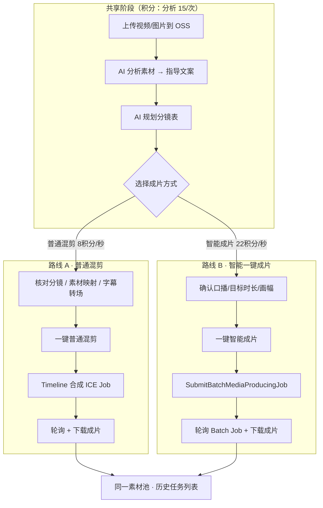
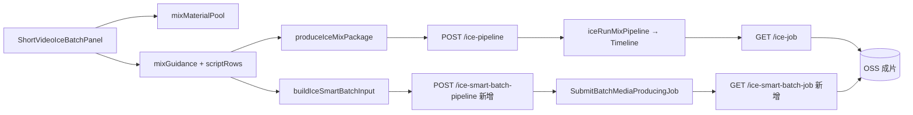

# AI 混剪双路线产品规划

> 文档版本：2026-07-10 · IMS 订阅已确认 · Phase 1 开发中  
> 适用范围：商家 ERP `cs.mofangdianai.com` → 短视频优化 → **AI混剪** Tab

---

## 1. 背景与目标

### 1.1 现状

- **路线 A（已实现）**：自研 Timeline 混剪 — 上传素材 → AI 分析 → AI 分镜 → `SubmitMediaProducingJob` 合成。
- 口播、字幕、多段拼接已稳定；观感偏「硬切拼接」，转场/BGM/智能选段能力因稳定性暂未全开。
- 成片扣费走现有 **`cloud_edit`（8 积分/秒）**；素材分析 **`mix_material_analyze`（15 积分/次）**。

### 1.2 目标

| 目标 | 说明 |
|------|------|
| **双路线并存** | 同一套素材池，用户可选「普通混剪」或「阿里云一键成片」 |
| **差异化计费** | 普通剪辑成本低；一键成片含 IMS 订阅 + AI 拆条/匹配，积分更高 |
| **共享上游** | 上传、AI 分析素材、指导文案、分镜表 **共用**，仅在「生成成片」处分叉 |
| **可运营** | 运营台可开关路线 B、配置模板 ID、调价系数 |

---

## 2. 双路线对比

| 维度 | 路线 A · 普通混剪 | 路线 B · 阿里云一键成片 |
|------|-------------------|-------------------------|
| **产品名（UI）** | 普通混剪 | 智能一键成片 |
| **阿里云 API** | `SubmitMediaProducingJob` + 自研 Timeline | `SubmitBatchMediaProducingJob` |
| **剪辑逻辑** | 分镜表驱动：段时长、素材映射、TTS、动效字幕 | IMS 内置：AI 拆条、图文匹配、随机转场/特效、模板 |
| **转场/滤镜** | Timeline 可控（逐步恢复 Fade/Transition/Filter） | `EditingConfig.ProcessConfig.AllowTransition` 等 |
| **口播** | CosyVoice MP3 + ICE 字幕轨（已实现） | 全局口播 / 分镜脚本模式（`SpeechConfig` / `SceneInfo`） |
| **可控性** | 高 — 分镜表、素材映射、截取点可改 | 中 — 模板 + 口播文案为主，细粒度弱 |
| **观感** | 结构化、字幕强；转场恢复后中等 | 更接近「自动剪辑师」，转场/节奏感强 |
| **稳定性** | 已冒烟，生产可用 | 依赖 IMS **订阅计费制**，需单独开通 |
| **积分（建议）** | **8 积分/秒**（沿用 `cloud_edit`） | **22 积分/秒**（新增 `cloud_edit_smart`） |
| **最低扣费（20 秒成片）** | max(80, 20×8) = **160 积分** | max(220, 20×22) = **440 积分** |

**官方文档索引：**

- 路线 A Timeline：[转场/特效/滤镜](https://help.aliyun.com/zh/ims/use-cases/transition-effect-filter)
- 路线 B 一键成片：[SubmitBatchMediaProducingJob](https://help.aliyun.com/zh/ims/developer-reference/api-ice-2020-11-09-submitbatchmediaproducingjob)
- 路线 B 参数：[脚本化自动成片](https://help.aliyun.com/zh/ims/use-cases/scripted-auto-slice) · [智能图文匹配](https://help.aliyun.com/zh/ims/use-cases/generic-scenario) · [进阶配置](https://help.aliyun.com/zh/ims/use-cases/one-click-blend-shear-logic-and-advanced-configuration)

---

## 3. 用户流程（共享素材 + 分叉成片）



### 3.1 共享规则

- **素材池**：`mixMaterialPool`（视频 + 图片），两条路线读取同一列表，无需重复上传。
- **AI 分析素材**：两条路线共用，**15 积分/次**（已有 `mix_material_analyze`）。
- **AI 规划分镜**：
  - 路线 A：**必须** — 作为 Timeline 输入。
  - 路线 B：**可选** — 若已有分镜表，可映射为 `SceneInfo.ShotScripts`；若无，可用指导文案走「全局口播模式」。

### 3.2 分叉规则

| 动作 | 路线 A | 路线 B |
|------|--------|--------|
| 生成按钮 | 「普通混剪」 | 「智能一键成片」 |
| 生成前校验 | 分镜 ≥2 段、素材 ≥2 条 | 素材 ≥2 条、口播/指导文案 ≥20 字 |
| 扣费时机 | ICE Job 提交成功且返回 jobId | Batch Job 提交成功且返回 batchJobId |
| 幂等键 | `cloud_edit:{jobId}` | `cloud_edit_smart:{batchJobId}` |

---

## 4. 积分扣费规则

### 4.1 计费种类（`MpPointsUsageKind` 扩展）

| kind | 中文名 | 单价 | 最低扣费 | 适用步骤 |
|------|--------|------|----------|----------|
| `mix_material_analyze` | AI 混剪素材分析 | **15 积分/次** | 15 | 共享（已有） |
| `cloud_edit` | 普通混剪成片 | **8 积分/秒** | 80（约 10 秒档） | 路线 A（已有） |
| **`cloud_edit_smart`** | 智能一键成片 | **22 积分/秒** | 220（约 10 秒档） | 路线 B（**新增**） |

### 4.2 计算公式

```text
普通混剪积分 = max(80, ceil(目标成片秒数) × 8)
智能成片积分 = max(220, ceil(目标成片秒数) × 22)
素材分析积分 = 15（每次点击「AI 分析素材」成功扣一次）
```

**示例（目标 20 秒竖屏探店）：**

| 操作 | 积分 |
|------|------|
| AI 分析素材 ×1 | 15 |
| 普通混剪 ×1 | 160 |
| 智能成片 ×1 | 440 |
| 同一批素材先普通再智能 | 15 + 160 + 440 = **615** |

### 4.3 定价依据（内部）

| 项 | 普通混剪 | 智能成片 |
|----|----------|----------|
| 阿里云侧 | ICE 合成时长费 | IMS **订阅** + 拆条/匹配算力 |
| 相对成本 | 基准 1× | 约 **2.5–3×** |
| 用户感知 | 可精细改分镜、成本低 | 省心、观感更「剪过」、价格高 |
| 毛利目标 | 沿用现有 50% 毛利模型 | 22/8 ≈ 2.75×，覆盖订阅摊销 |

> 运营台后续可增加「智能成片系数」配置项（默认 2.75），便于促销或调价。

### 4.4 代码落点（实现时）

| 文件 | 变更 |
|------|------|
| `src/lib/mpPointsEconomics.ts` | 新增 `MP_POINTS_CLOUD_EDIT_SMART_PER_SEC`、`cloud_edit_smart` kind |
| `src/services/mpAddonPointsSpendClient.ts` | `MpAddonGenerationKind` 增加 `cloud_edit_smart` |
| `vite-plugins/*mp*points*` | afford/spend 路由识别新 kind |
| `ShortVideoIceBatchPanel.tsx` | 双按钮 + 双 rate badge + 分叉扣费 |

---

## 5. 技术架构



### 5.1 路线 A（现有，增强项单列）

| 模块 | 路径 | 说明 |
|------|------|------|
| 成片引擎 | `src/services/iceMixProduceEngine.ts` | 分镜 → segments → editBrief |
| Timeline | `vite-plugins/aliyunIceCore.ts` | `buildTimelineFromMixClips` |
| 入口 API | `POST /api/meoo-merchant-ai-video-ice-pipeline` | 已有 |
| 轮询 | `GET /api/meoo-merchant-ai-video-ice-job` | 已有 |

**路线 A 增强 backlog（不影响路线 B 并行开发）：**

1. 安全恢复混剪转场（`Transition` + `MediaId`）
2. 默认 BGM + 可选保留原声
3. 接入 `planMixEditFromInstructions` 视觉选段

### 5.2 路线 B（新增）

| 模块 | 路径 | 说明 |
|------|------|------|
| Batch 网关 | `vite-plugins/aliyunIceSmartBatch.ts` | **新建** — 封装 IMS Batch API |
| Input 构建 | `buildIceSmartBatchInput()` | 素材 URL 列表 + 口播 + EditingConfig |
| 入口 API | `POST /api/meoo-merchant-ai-video-ice-smart-batch` | **新建** |
| 轮询 API | `GET /api/meoo-merchant-ai-video-ice-smart-batch-job` | **新建** |
| 回调（可选） | `POST /api/meoo-merchant-ai-video-ice-smart-batch-callback` | BatchProduceMediaComplete |

#### 5.2.1 路线 B 默认 `EditingConfig`（探店竖屏）

```json
{
  "ProcessConfig": {
    "AllowTransition": true,
    "UseUniformTransition": false,
    "TransitionList": ["linearblur", "colordistance", "crosshatch", "dreamyzoom"],
    "AllowVfxEffect": false,
    "EnableClipSplit": true,
    "SingleShotDuration": 4
  },
  "MediaConfig": { "Volume": 0.15 },
  "SpeechConfig": { "Volume": 1 },
  "BackgroundMusicConfig": { "Volume": 0.25 }
}
```

#### 5.2.2 路线 B 两种口播模式

| 模式 | 触发条件 | IMS 参数 |
|------|----------|----------|
| **全局口播** | 仅有指导文案、分镜表为空或未启用 | `InputConfig.SpeechText` + 全局 TTS |
| **分镜脚本** | 已有 `scriptRows` ≥2 段 | `SceneInfo.ShotScripts` 逐段口播 + 时长 |

优先实现 **分镜脚本模式**（与路线 A 共用 AI 规划分镜成果，用户体验一致）。

---

## 6. API 设计（新增）

### 6.1 提交智能一键成片

```http
POST /erp-api/meoo-merchant-ai-video-ice-smart-batch
Content-Type: application/json
Authorization: Bearer <token>
```

**Request（示意）：**

```json
{
  "materials": [
    { "kind": "video", "mediaUrl": "https://modianningbo.oss-cn-shanghai.aliyuncs.com/...", "label": "IMG_2053" }
  ],
  "targetTotalSec": 20,
  "width": 1080,
  "height": 1920,
  "guidance": "指导文案全文…",
  "scriptRows": [
    { "timeRange": "0-5秒", "visual": "门店外观", "dialogue": "这家藏在巷子里…" }
  ],
  "speechMode": "storyboard",
  "templateIds": [],
  "projectName": "mix-smart-街头牛排"
}
```

**Response：**

```json
{
  "ok": true,
  "batchJobId": "xxx",
  "pollUrl": "/erp-api/meoo-merchant-ai-video-ice-smart-batch-job?id=xxx"
}
```

### 6.2 轮询 Batch 任务

```http
GET /erp-api/meoo-merchant-ai-video-ice-smart-batch-job?id={batchJobId}
```

**Response（成功）：**

```json
{
  "ok": true,
  "status": "Success",
  "done": true,
  "downloadUrl": "/erp-api/meoo-merchant-ai-video-ice-smart-batch-download?id=xxx",
  "durationSec": 20
}
```

### 6.3 运营台配置（注册表扩展）

| 字段 | 说明 |
|------|------|
| `iceSmartBatchEnabled` | 是否展示路线 B（默认 false，开通 IMS 订阅后 true） |
| `iceSmartBatchTemplateIds` | `BatchEditingTemplateIdArray`，上限 50 |
| `iceSmartBatchDefaultSpeechMode` | `storyboard` \| `global` |
| `iceSmartBatchPointsMultiplier` | 相对普通混剪单价系数（默认 2.75） |

---

## 7. UI / UX 变更

### 7.1 成片区双按钮

```
┌─────────────────────────────────────────────────────────┐
│  分镜表（剪辑时间轴）                                      │
│  …                                                       │
├─────────────────────────────────────────────────────────┤
│  [ 普通混剪 ]  8 积分/秒 · 约 160 积分（20秒）              │
│  [ 智能一键成片 ]  22 积分/秒 · 约 440 积分（20秒）  🆕     │
│                                                          │
│  普通混剪：按分镜精细拼接，字幕/TTS 可控                    │
│  智能成片：阿里云 AI 拆条+转场，更像专业剪辑（积分更高）      │
└─────────────────────────────────────────────────────────┘
```

### 7.2 任务列表

| 字段 | 路线 A | 路线 B |
|------|--------|--------|
| 类型标签 | `普通混剪` | `智能成片` |
| 任务 ID | `iceJobId` | `batchJobId` |
| 扣费 kind | `cloud_edit` | `cloud_edit_smart` |

### 7.3 路线 B 不可用态

当 `iceSmartBatchEnabled !== true` 或 IMS 订阅未配置：

- 「智能一键成片」按钮 disabled
- Tooltip：「需在阿里云开通 IMS 智能一键成片订阅，请联系运营开通」

---

## 8. 阿里云侧前置条件（路线 B · 需你接入）

| # | 项 | 控制台 / 动作 | 提供给我们 |
|---|-----|----------------|------------|
| 1 | **IMS 订阅计费制** | 阿里云 → 智能媒体服务 → 开通「智能一键成片」订阅 | 确认已开通 |
| 2 | **ICE 应用** | 与路线 A 共用 `iceAppId`、AccessKey | 已有则跳过 |
| 3 | **Region** | 必须 `cn-shanghai`，与 OSS 素材同 region | 已有 |
| 4 | **（推荐）一键成片模板** | IMS 控制台创建 1–2 个探店/美食竖屏模板 | TemplateId 列表 |
| 5 | **（推荐）BGM 素材** | 自有版权 MP3 上传 OSS，或 IMS 模板内置 | OSS URL 列表 |
| 6 | **回调 URL（可选）** | 配置 Batch 完成回调到轻量 API | 域名确认 |

> 路线 A **不需要**额外订阅，仅需现有 ICE 云剪辑能力。

---

## 9. 实施分期

### Phase 0 · 文档与配置（当前）

- [x] 本规划文档
- [ ] 评审积分单价与 UI 文案
- [ ] 阿里云 IMS 订阅开通 + TemplateId 收集

### Phase 1 · 积分与 UI 骨架（约 3–5 人日）

- [ ] `mpPointsEconomics` 增加 `cloud_edit_smart`
- [ ] 双按钮 UI + 积分预估展示（路线 B 可先 disabled）
- [ ] 任务列表区分 `mixMode: timeline | smart_batch`

### Phase 2 · 路线 B 后端（约 5–8 人日）

- [ ] `aliyunIceSmartBatch.ts` + Batch 提交/轮询
- [ ] 新 API 路由注册 `ecs-auth-api-server.ts`
- [ ] 分镜脚本 → `SceneInfo` 映射
- [ ] 冒烟脚本 `ice-smart-batch-e2e-smoke.ts`（街头牛排素材 ×2）

### Phase 3 · 路线 A 观感增强（约 5–7 人日，与 Phase 2 可并行）

- [ ] 混剪转场安全恢复（MediaId + Transition）
- [ ] 默认 BGM + 视觉选段接入
- [ ] 更新 E2E 冒烟

### Phase 4 · 联调上线

- [ ] 本机 `ecs-pre-light-deploy-test.sh`
- [ ] 部署 **轻量** + **新ECS（cs）**
- [ ] 运营台打开 `iceSmartBatchEnabled`
- [ ] 用户验收：同一批素材各生成 1 条对比

---

## 10. 风险与回退

| 风险 | 缓解 |
|------|------|
| IMS 订阅未开通导致路线 B 全失败 | UI 默认关闭；仅路线 A 可用 |
| Batch Job 超时 / 成本高 | 轮询上限 10 分钟；失败不扣积分（仅提交成功扣费） |
| 两条路线成片风格差异大 | 产品说明 + 示例对比视频 |
| 积分争议 | 生成前展示预估；扣费 note 带 `mixMode` + jobId |

**回退：** 运营台 `iceSmartBatchEnabled=false` 即隐藏路线 B，路线 A 不受影响。

---

## 11. 验收标准

| # | 场景 | 预期 |
|---|------|------|
| 1 | 上传 11 条 MOV → AI 分析 | 15 积分扣 1 次；指导文案填入 |
| 2 | AI 规划分镜 → **普通混剪** 20 秒 | Success；约 160 积分；任务标「普通混剪」 |
| 3 | 同一素材 → **智能成片** 20 秒 | Success；约 440 积分；任务标「智能成片」 |
| 4 | 积分不足 | 对应按钮提示所需积分，不提交任务 |
| 5 | IMS 未开通 | 智能按钮 disabled + 说明文案 |
| 6 | 路线 B E2E 冒烟 ×2 | 脚本 exit 0（街头牛排素材） |

---

## 12. 附录：与现有代码映射

| 概念 | 现有符号 |
|------|----------|
| 混剪面板 | `ShortVideoIceBatchPanel.tsx` |
| 素材池 | `mixMaterialPool` / `IceMixMaterialSlot` |
| 普通成片 API | `postIcePipeline` → `/meoo-merchant-ai-video-ice-pipeline` |
| 普通扣费 | `spendMpAddonPoints({ kind: 'cloud_edit' })` |
| 分析扣费 | `spendMixMaterialAnalyzePoints` |
| 积分经济 | `src/lib/mpPointsEconomics.ts` |
| ICE 核心 | `vite-plugins/aliyunIceCore.ts` |
| 全链路 E2E | `scripts/ice-mix-full-e2e-smoke.ts` |

---

**下一步：** 评审本文档 §4 积分单价与 §8 阿里云订阅；确认后按 Phase 1 起开发。
