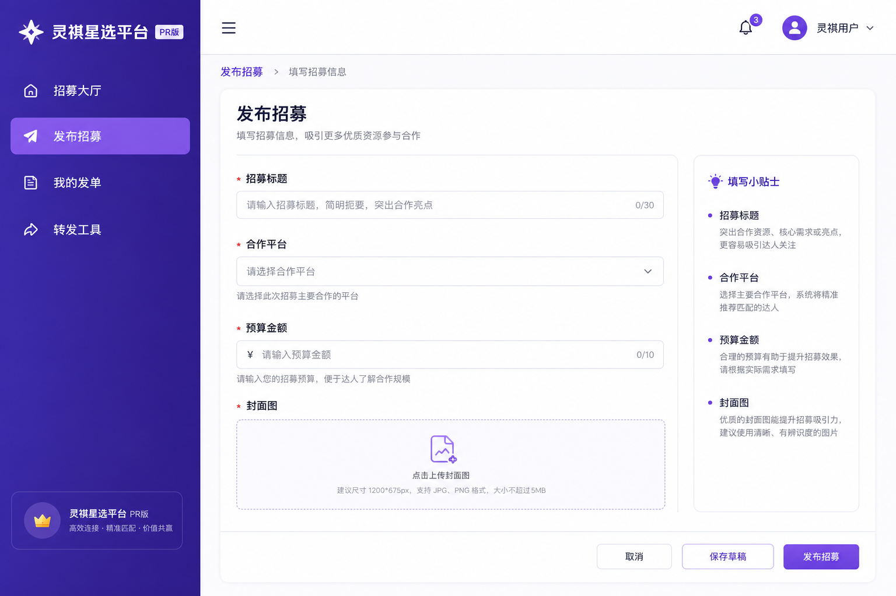

# 灵祺星选平台（Web）· 图文版使用说明书

> 配套文字版：`使用说明书-灵祺星选平台.md`  
> 访问：[https://dr.mofangdianai.com](https://dr.mofangdianai.com)  
> 生成日期：2026-06-10 · 配图由 AI 生成示意

---

## 图 1 · PR 版工作台

PR 登录后左侧导航聚焦 **发单 → 管理 → 转单**：



| 菜单 | 用途 |
|------|------|
| 招募大厅 | 浏览市场全部招募 |
| 发布招募 | 创建新招募单 |
| 我的发单 | 订单与报名审核 |
| 转发工具 | 外部表单转单 |
| 我的模版 | 报名表字段配置 |

---

## 图 2 · 达人 / 团队版工作台

达人、拍摄、剪辑团队登录后侧重 **找单与报名**：


| 菜单 | 用途 |
|------|------|
| 招募大厅 | 筛选 + 急单 + 推荐 Tab |
| 我的报名 | 跟踪审核状态 |
| 我的 | 完善达人/团队资料 |

左侧底部可 **切换身份**（达人 ↔ 拍摄 ↔ 剪辑 ↔ PR）。

---

## 图 3 · 发布招募（PR）

```
发布招募 → 选目标(达人/拍摄/剪辑) → 填标题平台预算 → 上传封面 → 选模版 → 发布
```

**封面建议：** 高清横版或竖版海报；分享至小程序时会自动裁成 **5:4 铺满**。

**模版：** 在「我的模版」预先配置字段，发单时一键关联。

---

## 图 4 · 转发工具流程

适用：报名表在腾讯文档 / 飞书，想用灵祺流量分发。

```
粘贴原表链接 → 填备注 → 预览(可 inline 编辑) → 重新预览 / 发布
```

发布后：

- Web / 小程序详情显示 **「前往原表报名」**  
- 正文内原表链接行已隐藏，仅按钮跳转  
- 支持导出数据辅助回填原表  

---

## 图 5 · 报名与审单

### 达人侧

招募详情 → **立即报名** → 填表 → **我的报名** 查状态

### 转单招募

详情 → **前往原表报名** → 浏览器新窗口打开 HTTPS 原表

### PR 侧

**我的发单** → 选订单 → **报名列表** → 通过 / 拒绝 → 消息通知达人

---

## 图 6 · Web 与小程序对照

| 功能 | Web | 小程序 |
|------|:---:|:------:|
| 招募大厅 | ✓ | ✓ |
| AI 推荐 | ✓ | ✓ |
| PR 发单 | ✓ | ✓ |
| 转发工具 | ✓ | ✓ |
| 审报名 | ✓ | ✓ |
| 微信分享卡片 | — | ✓ |

**建议：** PR 用 Web 发单审单；达人用小程序浏览、分享、移动端报名。

---

## 图 7 · 常见问题

| 问题 | 答案 |
|------|------|
| 转单还显示「立即报名」 | 部署最新 Web：`ecs-deploy-talent-fulfillment-web.sh` |
| 预览想改文案 | 预览区直接编辑，无需返回上一步 |
| 数据不同步 | 同一微信账号；API 走 ECS 数据面 |
| 帮助入口 | `/help` 或 docs 目录文字说明书 |

---

## 相关文档

- 文字详版：`docs/使用说明书-灵祺星选平台.md`  
- 小程序图文版：`docs/使用说明书-灵祺达人撮合小程序-图文版.md`  

*灵祺 AI · 灵祺星选平台*
