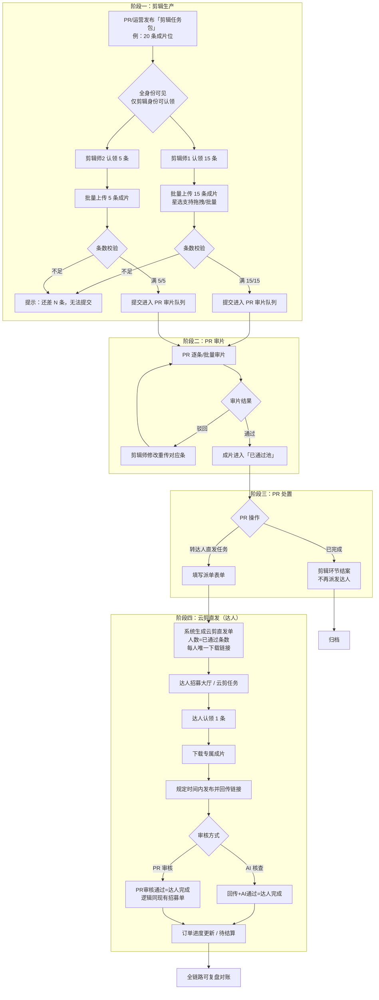
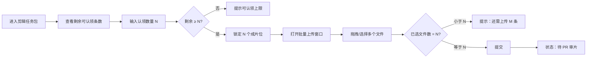
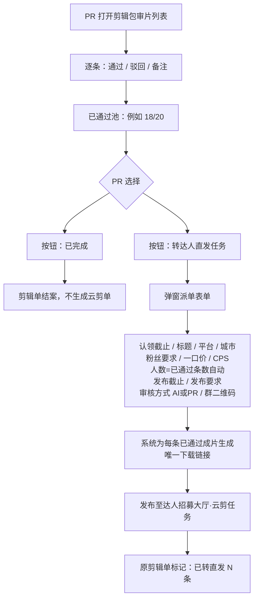
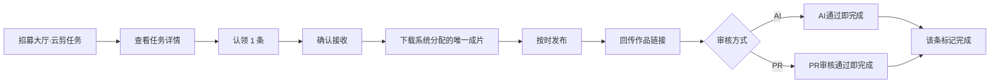
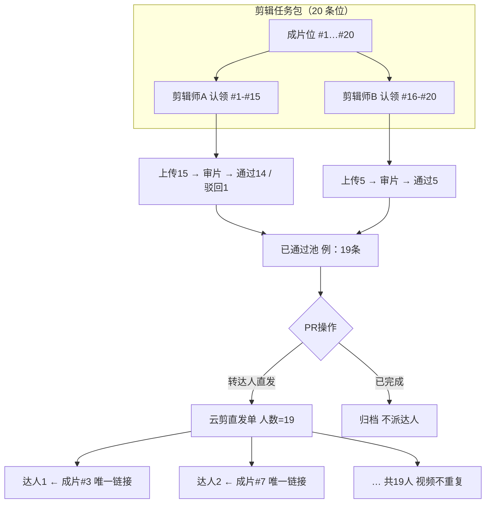

# 剪辑任务 → 云剪直发 · 业务流程图

> 文档版本：2026-06 · 产品流程说明（非代码实现文档）

---

## 1. 端到端主流程

---

## 2. 剪辑师侧详细流程

---

## 3. PR 审片 → 转达人直发

---

## 4. 达人侧（云剪直发）流程

---

## 5. 数据关系示意

---

## 6. 文字摘要

### 角色

| 角色 | 职责 |
|------|------|
| 剪辑师（剪辑身份） | 按条认领、按条批量上传成片 |
| PR | 逐条审片；「已完成」或「转达人直发」 |
| 达人 | 云剪直发单认领 1 条，发布并回传链接 |

### 核心规则

1. 认领粒度 = **1 条成片位**，多人可拆分同一剪辑包。
2. **上传条数 = 认领条数**，不足不可提交，系统提示缺几条。
3. 仅 **审片通过** 的成片可进入「转达人直发」池。
4. 转直发时 **人数 = 已通过条数**，**一人一条**，下载链接不重复。
5. **AI 核查**：回传+通过即完成；**PR 审核**：同现有达人招募审核逻辑。

### 转直发派单字段

认领截止时间、标题、发布平台、城市、达人粉丝要求、一口价、CPS、人数（自动）、发布截止时间、发布要求、视频下载链接（系统按条生成）、审核方式（AI/PR）、群二维码（可选）。

---

## 导出为图片 / PDF

- **方式 A**：用浏览器打开同目录下的 `剪辑任务-云剪直发全流程.html`，右键另存为 PDF 或截图。
- **方式 B**：将本文件 `.md` 导入 [Mermaid Live Editor](https://mermaid.live)，逐段导出 PNG/SVG。
- **方式 C**：VS Code / Cursor 安装 Mermaid 预览插件，预览后导出。
