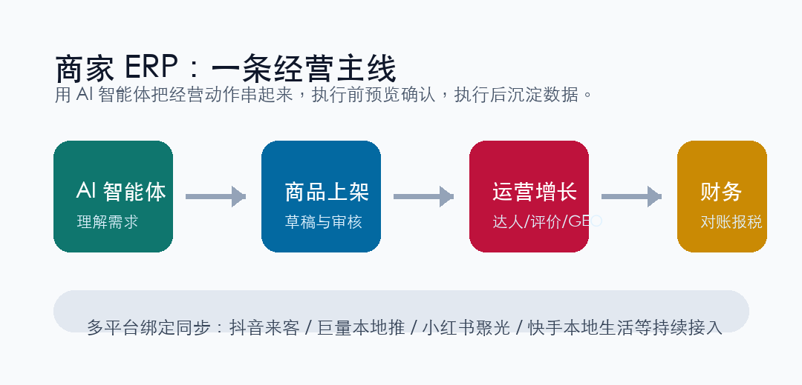

# 首发｜灵祺 AI 智能 ERP 商家版：本地生活门店，终于有了自己的 AI 经营中枢

本地生活商家的经营，正在变得越来越复杂。

一个门店要同时面对商品上架、团购套餐、达人探店、评价维护、本地推投放、线索跟进、财务对账，还要在抖音来客、小红书、快手、美团、巨量本地推等平台之间来回切换。

过去，很多商家不是没有工具，而是工具太分散。

今天，我们正式发布：**灵祺 AI 智能 ERP 商家版 V1.0**。

它不是又一个“表格后台”，而是一套面向本地生活商户的 AI 经营系统。我们希望它能帮商家把每天重复、琐碎、容易漏掉的运营动作，变成一条更清晰、更可执行的经营主线。

## 一、从“打开很多后台”，到“一个经营入口”

灵祺商家版围绕门店日常经营，搭建了完整的功能结构：

- 首页经营看板：快速查看门店状态、经营数据和待办事项。
- 店铺管理：维护门店信息、菜单价目表、店铺装修。
- 商品管理：新建商品、商品列表、草稿编辑、平台同步。
- 运营中心：达人招募、活动、评价、GEO、竞对分析、AI 文章与话题、短视频 AI 处理、数字人口播。
- 投流与线索：本地推投放管理、线索跟进。
- 财务管理：财务对账、报税管理。
- 系统设置：平台绑定、会员订阅、在线客服、账号与权限。

这些能力最终服务同一个目标：**让商家少切后台，多做决策；少靠经验硬扛，多用数据和 AI 辅助执行。**

## 二、AI 智能体：不只是聊天，而是能执行经营任务

商家版的核心，是灵祺 AI 智能体。

你可以像和运营同事沟通一样，直接描述需求：

“帮我上一个双人套餐。”

“下周想做达人探店，预算 3000，帮我出 Brief。”

“最近评价有点差，帮我分析一下应该怎么回复。”

“帮我规划一下本月抖音推广。”

AI 不会直接替你冒险操作。它会先生成方案或预览卡片，商家确认后，再写入草稿、生成招募订单或给出执行建议。

这套“先预览、再确认、再执行”的机制，是我们非常重视的一点。因为经营系统不是玩具，真正的 ERP 必须尊重业务风险。

## 三、商品、达人、评价、GEO，一起进入经营闭环

商家版不是单点工具，而是围绕本地生活的真实经营链路设计。

商品上架时，系统支持从平台、类目、商品详情到草稿保存的流程衔接；达人招募时，可以通过 AI 生成 Brief，进入订单流转；评价管理、GEO 优化、竞对分析、推广文案和短视频处理，也都围绕“提升门店曝光、转化和复购”展开。

尤其对本地生活商家来说，经营往往不是单一动作。

一个新品套餐，可能同时需要：

- 商品草稿
- 门店素材
- 达人 Brief
- 评价话术
- GEO 文案
- 本地推创意
- 财务核算

灵祺商家版希望把这些动作连起来，而不是让商家在不同平台里反复复制、粘贴、催进度。

## 四、Web + 小程序，电脑端做复杂经营，手机端做高频动作

商家版同时配套微信小程序。

电脑端适合处理复杂表格、商品流程、数据分析和运营配置；小程序适合快速查看工作台、订阅会员、在线客服、商品列表、语音创建商品、达人招募入口等高频动作。

也就是说，商家不需要一直守在电脑前。

门店现场、外出路上、临时沟通，都可以通过小程序完成轻量操作；真正复杂的经营决策，再回到 Web 端完成。

## 五、我们想服务什么样的商家

灵祺商家版首先面向本地生活商户，尤其适合：

- 餐饮、休闲娱乐、丽人、亲子、生活服务等门店。
- 已经在抖音、小红书、快手等平台做经营，但后台分散的商家。
- 需要达人探店、短视频内容、GEO 优化、本地推线索的商家。
- 想把运营流程标准化、数据化、AI 化的门店团队。

我们相信，本地生活商家的数字化，不应该只是“多一个后台”。

真正有价值的系统，应该帮商家把商品、内容、达人、投流、评价和财务串成一个持续运转的经营飞轮。

## 六、灵祺商家版，正式首发

灵祺 AI 智能 ERP 商家版 V1.0 已正式发布。

这是我们为本地生活商家交出的第一版答案：让 AI 不停留在内容生成，而是进入真实经营流程；让 ERP 不只是记录数据，而是帮助门店把每一天的经营动作做得更快、更稳、更清楚。

欢迎本地生活商家、门店运营团队、连锁品牌一起体验。

**灵祺 AI 智能 ERP 商家版，让门店经营从“忙着处理问题”，走向“主动设计增长”。**
