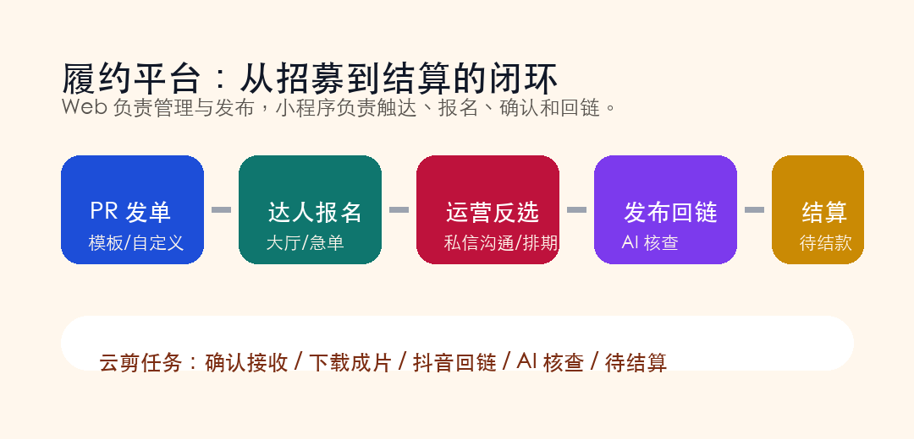

# 首发｜灵祺达人履约平台上线：让招募、报名、拍剪、云剪和结算真正闭环

达人招募最难的地方，往往不在“发出去”。

真正难的是后面这一串流程：谁报名了、谁合适、谁沟通过、谁确认探店、谁拿到了成片、谁发布了链接、内容有没有核查、什么时候结算。

只靠群聊和表格，很快就会乱。

今天，我们正式发布：**灵祺达人履约平台 V1.0**，包含 Web 管理端与微信小程序。

它面向达人、PR、拍摄团队、剪辑团队和运营管理人员，目标只有一个：**让达人招募从“撮合”走到“履约”，从“有人报名”走到“完成交付”。**

## 一、Web + 小程序：不同角色在同一套数据里协同

灵祺达人履约平台采用 Web 与小程序互通的方式。

Web 端适合 PR 和运营做发布、管理、筛选、沟通、订单查看；小程序适合达人、拍摄剪辑团队快速浏览任务、报名、确认、回传链接和接收消息。

平台支持同一账号体系，达人身份与 PR 身份可以切换，数据与招募订单、达人库、PR 信息、消息会话互通。

这意味着，大家不用再在多个表格、多个群、多个账号之间找信息。

## 二、招募大厅、急单大厅、拍剪任务，任务分层更清楚

履约平台把任务入口拆成更符合业务场景的大厅：

- 招募大厅：常规达人探店、品宣、直播等任务。
- 急单大厅：报名周期更短、时效要求更强的任务。
- 拍剪任务：拍摄任务、剪辑任务、云剪任务。
- 推荐：优质达人与匹配订单。
- 发招募：PR 可按默认模板或自定义模板发布任务。
- 消息：PR 与达人之间的私信沟通。
- 我的：达人、PR、拍摄、剪辑等身份资料与订单管理。

不同类型任务分开展示，达人能更快找到适合自己的单，PR 也能更清楚地管理发布效果。

## 三、云剪闭环：从成片派发到抖音回链

云剪任务是履约平台非常重要的一条闭环能力。

在云剪场景中，运营或 PR 可以把成片任务下发到小程序，达人进入任务后完成：

确认接收或拒绝任务。

下载已分配的成片。

发布到抖音等平台。

回传作品链接。

系统进行 AI 核查。

进入待结算状态。

这让“云剪成片给到达人之后，到底有没有发、发得对不对、能不能结算”这件事，有了可追踪的流程。

## 四、PR 与达人私信，把沟通沉淀在订单里

真实业务里，招募不是简单的“报名”和“通过”。

PR 需要确认档期、报价、账号情况、内容形式；达人也需要询问门店、预算、探店要求和结算方式。

履约平台内置消息能力，PR 可以在推荐达人、报名列表、订单详情里发起沟通；达人可以在商单详情或消息页回复。

沟通不再只散落在微信私聊里，而是和任务、订单、身份、报名关系建立连接。

## 五、达人、拍摄、剪辑、PR，不只是一个身份标签

平台支持多种工作身份：

- 达人：承接探店、品宣、直播等任务。
- 拍摄团队：承接跟拍、活动、产品静物等拍摄任务。
- 剪辑团队：承接探店成片、品宣包装、云剪合成等任务。
- PR：发布招募、管理报名、沟通筛选、查看订单。

每个角色都可以维护自己的资料、平台账号、报价、标签和合作信息。

这对履约效率很关键。因为一个好的内容交付平台，不只是“谁抢到了单”，而是要知道“谁适合这个单”。

## 六、我们希望解决的，是本地生活内容交付的最后一公里

灵祺达人履约平台适合：

- 做本地生活达人招募的运营团队。
- 有大量探店、云剪、拍摄剪辑需求的商家或服务商。
- 管理达人库、PR、拍摄剪辑团队的内容机构。
- 希望把报名、沟通、发布、回链、核查、结算流程标准化的团队。

过去，很多团队靠群聊推动交付。

群聊很快，但不沉淀；表格很清楚，但不实时；人工催进度很有效，但不可规模化。

灵祺达人履约平台要做的，就是把这些环节放回一套流程里。

## 七、灵祺达人履约平台，正式首发

灵祺达人履约平台 V1.0 已正式上线。

它连接 Web 端与小程序，连接 PR、达人、拍摄、剪辑和运营，也连接从招募到结算的每一个关键节点。

我们相信，本地生活内容增长的下一步，不只是找到更多达人，而是把每一次合作交付得更清楚、更稳定、更可复盘。

**灵祺达人履约平台，让每一次招募，都走向可交付的结果。**
