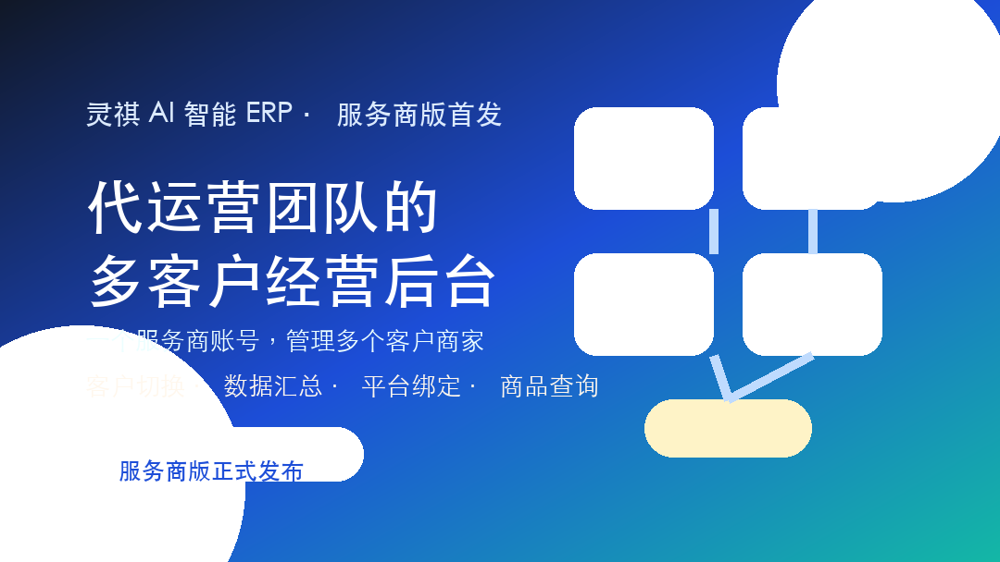
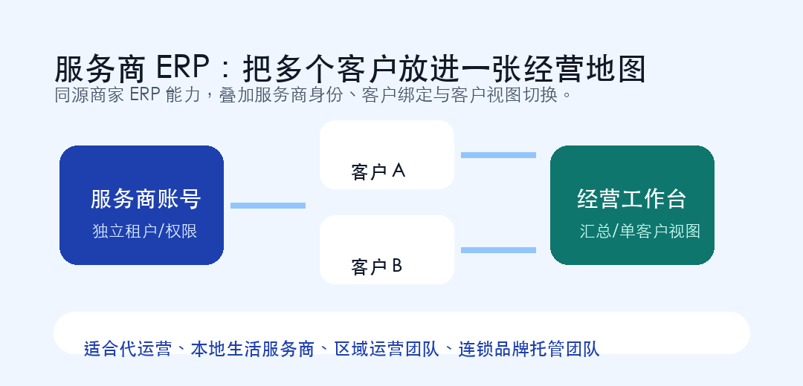

# 首发｜灵祺 AI 智能 ERP 服务商版：为代运营团队打造的多客户经营后台

服务商和单个商家最大的区别是什么？

商家要经营好自己的门店。

服务商要同时经营好很多客户的门店。

这意味着，服务商每天面对的不是一个账号、一组数据、一套商品，而是多个客户、多个平台、多个经营目标、多个待办事项。

今天，我们正式发布：**灵祺 AI 智能 ERP 服务商版 V1.0**。

它基于灵祺商家 ERP 的同源能力，为代运营公司、本地生活服务商、区域运营团队和连锁托管团队，提供独立的服务商版本。

## 一、不是“多个商家账号拼在一起”，而是服务商自己的后台

服务商版拥有独立的注册和登录体系，账号类型与商家版区分。

服务商可以在系统中绑定自己的服务商身份，也可以绑定代运营客户商家账号，并在顶部快速切换客户视图。

这件事看似简单，但对日常代运营很重要。

因为服务商真正需要的，不是每天登录 A 客户、退出、再登录 B 客户，而是在一套后台里完成：

- 查看全部客户的汇总情况。
- 切到某个客户查看具体经营数据。
- 管理客户商家的商品与平台数据。
- 承接商家版的 AI、商品、运营、财务等能力。

## 二、全部客户汇总与单客户视图，兼顾管理和执行

服务商版的核心能力之一，是客户视图切换。

当服务商选择“全部客户”时，可以站在管理者角度查看整体情况，适合做团队排班、客户盘点、经营复盘和优先级判断。

当服务商切换到某一个客户时，又可以进入单客户视角，处理具体商品、门店、运营和数据问题。

这种结构更符合服务商的真实工作方式：

上午看全盘，判断哪些客户需要优先处理。

下午切到重点客户，处理商品、内容、达人、评价和投流问题。

晚上再回到汇总视图，复盘团队当天交付情况。

## 三、同源商家 ERP 能力，服务商也能用

服务商版与商家 ERP 共用同一套前端能力，通过版本模式区分。

这意味着商家版中已经沉淀的核心功能，服务商版可以继承使用：

- AI 智能体辅助经营判断和执行。
- 商品创建、商品列表和平台商品查询。
- 门店、菜单、装修等基础信息管理。
- 达人招募、评价管理、GEO、竞对分析。
- AI 文章与话题、短视频 AI 处理、数字人口播。
- 本地推、线索、财务对账等经营模块。

服务商不是从零开始搭后台，而是在商家 ERP 能力之上，叠加“多客户管理”这一层。

## 四、平台绑定与客户绑定，支持代运营工作流

服务商版在设置中提供服务商平台能力，可以绑定各平台服务商身份。

同时，服务商可以在“客户商家”中绑定代运营客户商家账号。

商品查询场景中，系统也支持服务商查询类型，用于服务商身份下的商品数据读取。

这让代运营团队可以围绕真实客户关系建立工作流，而不是靠线下表格记录“这个客户是谁负责、哪个账号绑定了、哪个平台能查”。

## 五、谁适合使用服务商版

灵祺服务商版适合：

- 本地生活代运营公司。
- 抖音、小红书、快手等平台服务商。
- 管理多个商家的区域运营团队。
- 连锁品牌的外部托管或内部运营中台。
- 同时负责商品、内容、达人、投流、评价和数据复盘的团队。

如果你的团队每天都在多个客户之间切换，如果你们已经感受到“客户越多，协同越乱”，服务商版就是为这个阶段准备的。

## 六、服务商需要的，是可规模化的交付系统

服务商的核心竞争力，最终不是“能不能做一个客户”，而是“能不能稳定做好很多客户”。

这需要三个基础：

第一，客户数据要能统一管理。

第二，具体执行要能快速切换。

第三，团队交付要能沉淀成流程。

灵祺 AI 智能 ERP 服务商版，就是围绕这三个基础搭建。

## 七、灵祺服务商版，正式首发

灵祺 AI 智能 ERP 服务商版 V1.0 已正式发布。

它不是商家版的简单复制，而是面向服务商工作方式的一次产品延展：从单客户经营，走向多客户管理；从人工切号，走向统一视图；从项目制交付，走向系统化运营。

**灵祺 AI 智能 ERP 服务商版，让代运营团队把多个客户，管成一套清楚的经营体系。**
